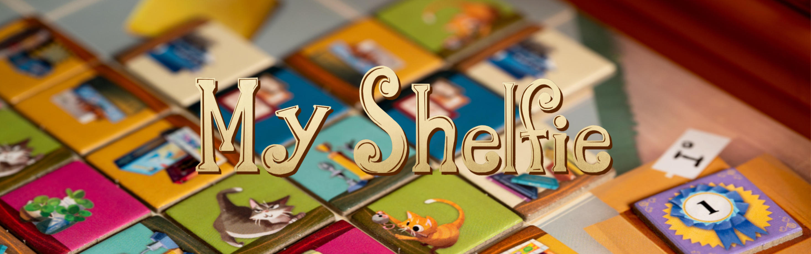

# Prova Finale Ingegneria del Software- AA 2022-2023 

📚🏆Implementatation of the game table [My Shelfie](https://www.craniocreations.it/prodotto/my-shelfie) 📚🏆

# Group Members 🧑🏻‍🦱👩🏻🧑🏻‍🦱🧑🏻‍🦱
+ Francesco Maberino (francesco.maberino@mail.polimi.it)
+ Francesca Pia Panaccione (francescapia.panaccione@mail.polimi.it)
+ Francesco Santambrogio (francesco.santambrogio@mail.polimi.it)
+ Carlo Terzuoli (carlo.terzuoli@mail.polimi.it)

# Documentation 📃

## Implemented Functionalities

| Functionality             |                              State                              |
|:--------------------------|:---------------------------------------------------------------:|
| Complete rules            |  |
| TUI                       |  |
| GUI                       |  |
| RMI                       |  |
| Socket                    |  |
| Multiple games            |  |
| Persistence               |  |](https://maven.apache.org/)
| Disconnections resilience |  |


## Jar Execution↩︎
The Maven Shade Plugin was used to construct the jars. Go to the project's root and issue the following command to compile the jars yourself:
```bash
java mvn clean package
```
The ```target/```  folder will include the compiled jars under the names of ```ServerApp.jar``` e ```ClientApp.jar```.

Otherwise, check directly [ClientApp.jar](/deliverables/ClientApp.jar) and [ServerApp.jar](/deliverables/ServerApp.jar).
### CLI

Type the following command from the terminal to start My Shelfie  with CLI:
```bash
java -jar ClientApp.jar --cli
```

#### GUI

Type the following command from the terminal to start My Shelfie  with GUI:
```bash
java -jar ClientApp.jar
```

#### SERVER 

Type the following command from the terminal to start the server:
```bash
java -jar AppServer.jar
```


## Tools ⚙️
+ [draw.io]( https://app.diagrams.net/) - UML Diagrams
+ [Maven](https://maven.apache.org/) - Dependency Managament
+ [IntelliJ](https://www.jetbrains.com/idea/) - IDE
+ [JavaFx](https://openjfx.io/) - Graphical Framework
